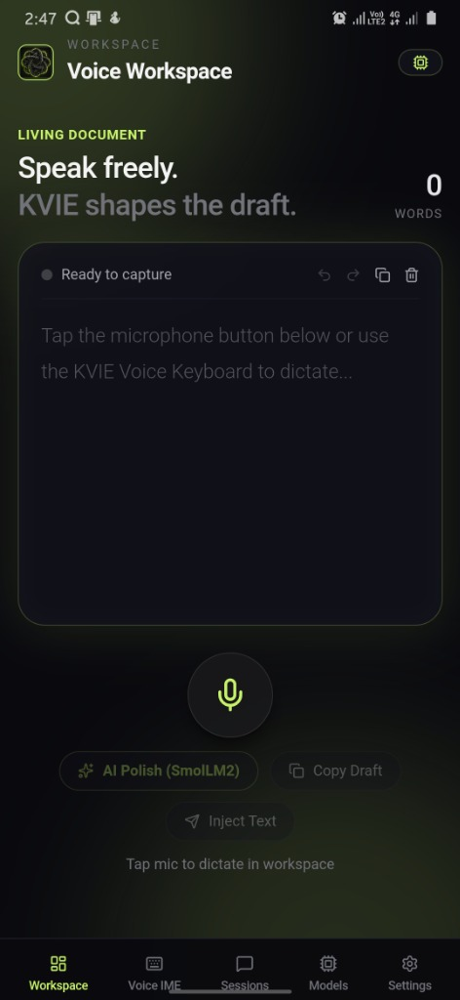
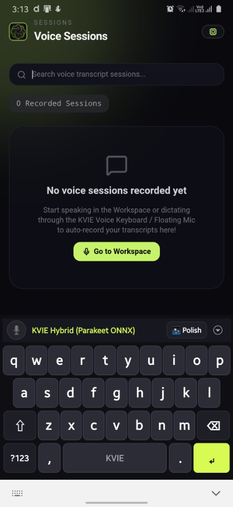
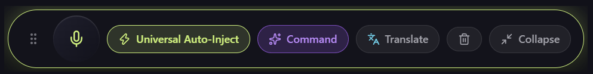
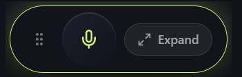

<p align="center">
  
</p>

<h1 align="center">🎙️ Kritix - Voice Intelligence Engine (KVIE)</h1>

<p align="center">
  <b>Local-First, Ultra-Fast AI Voice Typing & System-Wide Auto-Injection Engine for Desktop (Windows & macOS) and Android Mobile.</b><br />
  <i>100% Wispr Flow Parity with Complete On-Device Privacy & Zero Cloud Latency.</i>
</p>

<p align="center">
  <a href="https://tauri.app"></a>
  <a href="https://www.rust-lang.org/"></a>
  <a href="https://developer.android.com/"></a>
  <a href="https://microsoft.com"></a>
  <a href="https://apple.com"></a>
  <a href="https://react.dev/"></a>
  <a href="https://www.typescriptlang.org/"></a>
  <a href="LICENSE"></a>
</p>

---

## 📸 Screenshots & Showcase

<table align="center" width="100%">
  <tr>
    <td align="center" width="50%">
      <b>📱 Mobile Voice Workspace</b><br/><br/>
      
    </td>
    <td align="center" width="50%">
      <b>⌨️ Next-Gen Keyboard & Voice Sessions</b><br/><br/>
      
    </td>
  </tr>
  <tr>
    <td align="center" colspan="2">
      <b>🖥️ Desktop Floating Mic Pill Widget (Expanded & Compact)</b><br/><br/>
      <br/>
      
    </td>
  </tr>
</table>

---

## ✨ Overview

**Kritix Voice Intelligence Engine (KVIE)** is an open-source, private, local-first voice productivity suite. It transforms your raw speech into polished, context-aware prose across **any Windows, macOS, or Android application** (WhatsApp, Chrome, Gmail, Slack, VS Code, Discord, Notes, Microsoft Office, Telegram, and more).

Unlike cloud-dependent solutions (such as Wispr Flow) that upload your audio stream to external servers, **KVIE executes entirely on your hardware**:
- **Desktop (Windows & macOS)**: Tauri v2 + Rust core leveraging Win32 `WH_KEYBOARD_LL` and macOS `CGEventTap` for global hotkeys, Windows UI Automation (`IUIAutomation`) & macOS `AXUIElement` for surrounding text context, and local Whisper / Qwen2.5-1.5B models.
- **Android Mobile**: High-performance native Kotlin input method (`InputMethodService`), accessibility automation (`AccessibilityService`), floating mic overlay (`WindowManager`), and on-device **SmolLM2-360M** + **NVIDIA Parakeet ONNX** models.

---

## 📊 Feature Comparison Matrix

| Feature / Architecture Layer | Wispr Flow | Gboard / Samsung | Kritix (KVIE) |
| :--- | :---: | :---: | :---: |
| **Complete Local & Offline Execution** | ❌ (Cloud-only) | ⚠️ (Basic offline) | ✅ **100% Private On-Device Models** |
| **System-Wide Global Hotkey (`Ctrl+Alt+R` / `⌘+⌥+R`)** | ✅ | ❌ | ✅ **Windows (`WH_KEYBOARD_LL`) & macOS (`CGEventTap`)** |
| **Cross-App Auto-Inject Everywhere** | ✅ | ❌ | ✅ **Differential `eraseAndInject` + UI Automation** |
| **Surrounding Text Context Awareness** | ✅ | ❌ | ✅ **0ms OS Accessibility Reader** |
| **AI LLM Post-Processing (Tone & Polish)** | ✅ | ❌ | ✅ **SmolLM2-360M & Qwen2.5-1.5B (Formal, Casual, Shorten)** |
| **Per-App Automatic Tone Adaptation** | ❌ | ❌ | ✅ **Auto-detects WhatsApp ➔ Casual vs. Gmail ➔ Formal** |
| **Spoken Voice Editing Commands** | ❌ | ❌ | ✅ **"Delete that", "Clear all", "New line", "Make formal"** |
| **Next-Gen Android QWERTY Keyboard** | ❌ | ✅ | ✅ **Full QWERTY, Number Row (`123`), Alt-Symbols** |
| **Case-Aware Autocorrect & Bigram Prediction** | ❌ | ✅ | ✅ **Contextual next-word & grammar fixes** |
| **500+ Emoji Library with Real-Time Search** | ❌ | ✅ | ✅ **8 Categories + Live Keyword Search** |
| **Multi-Item Clipboard History Drawer** | ❌ | ✅ | ✅ **Recent clips drawer with instant paste** |
| **Voice Snippets & Text Expansion** | ✅ | ❌ | ✅ **Spoken trigger expansion** (e.g. *"my calendly"*) |
| **Live Multi-Language Translation** | ✅ | ⚠️ (Cloud) | ✅ **100+ Languages with local target injection** |

---

## 🚀 Flagship Features

### 🖥️ Desktop (Windows & macOS)

1. **⌨️ Global Hotkey & System Tray**:
   - Dedicated hotkey (`Ctrl + Alt + R` on Windows, `Cmd + Option + R` on macOS) brings up voice capture anywhere.
   - Runs silently in the system tray with instant minimize/restore.
2. **👁️ Surrounding Context Reader**:
   - Reads up to 500 characters of surrounding text before the cursor using native COM `IUIAutomation` (Windows) or `AXUIElement` (macOS).
3. **🪄 Compact Floating Mic Pill**:
   - Always-on-top draggable pill widget with 1-click expand/collapse, Universal Auto-Inject, Voice Command Mode, and Translate.
4. **⚡ Voice Snippets & Expansion**:
   - Spoken cues expand into rich text templates (e.g., *"my signature"* expands into complete multi-line sign-offs).
5. **📖 Custom Brand Dictionary**:
   - Custom phonetic rules bias transcription and formatting (*"critics"* ➔ *"Kritix"*, *"tauri"* ➔ *"Tauri"*).

---

### 📱 Android Mobile (Keyboard & Floating Mic)

1. **⌨️ Full-Featured QWERTY Keyboard**:
   - Dedicated toggleable number row (`123`) above QWERTY.
   - Long-press alternate symbols on every key (`q`➔`1`, `w`➔`2`, `a`➔`@`, `s`➔`#`, `m`➔`?`).
   - Shift, Caps Lock, Comma, Dot, and Action Enter key (`↵`).
   - Clean **Material Design Vector Icons** (`ic_clipboard`, `ic_emoji`, `ic_sparkle`, `ic_backspace`, `ic_search`).
2. **🧠 Case-Aware Autocorrect & Contextual Bigrams**:
   - **Intelligent Casing**: Preserves user input case in mid-sentence (`the`, `that`) and only capitalizes at sentence starts (`. `, `? `, `! `, `\n`).
   - **Grammar Corrections**: Instantly fixes `dont` ➔ `don't`, `im` ➔ `I'm`, `teh` ➔ `the`, `recieve` ➔ `receive`, `critics` ➔ `Kritix`.
   - **Next-Word Bigrams**: Context-driven predictions (e.g., `how ` suggests `are`, `is`, `about`; `thank ` suggests `you`, `so`, `much`).
3. **😍 500+ Emojis with Real-Time Search**:
   - 8 rich categories: Smileys (110+), Gestures (60+), Hearts (40+), Fire/Vibes (55+), Animals (80+), Food (70+), Travel (60+), Objects (60+).
   - Real-time search bar (`🔍 Search emoji...`) filters matching emojis dynamically as you type (`love`, `fire`, `dog`, `pizza`, `laugh`, etc.).
4. **🗣️ Real-Time Voice Editing Commands**:
   - Hands-free speech editing without touching the screen:
     - *"Delete that"* / *"Scratch that"* ➔ Deletes the last spoken word/phrase.
     - *"Delete last sentence"* ➔ Wipes back to the previous sentence boundary.
     - *"Clear all"* ➔ Clears the active input field.
     - *"New line"* / *"Enter"* ➔ Inserts a paragraph break.
     - *"Make this formal"* / *"Make this casual"* ➔ Rewrites text on-the-fly.
5. **✨ Quick AI Actions & Per-App Tone**:
   - Sparkle icon expands into instant AI quick action chips: `[Formal]`, `[Casual]`, `[Shorten]`, `[To English]`.
   - Automatically adapts tone: **Casual** in WhatsApp/Instagram/Telegram, **Formal** in Gmail/LinkedIn/Slack/Teams.
6. **📋 Multi-Item Clipboard History Drawer**:
   - Intercepts system clipboard and stores recent copy items as quick-tap chips.
7. **🎙️ Dual Input Options**:
   - Use the embedded keyboard mic key or launch the draggable **Floating Mic Bubble** over any app.

---

## 🏗️ System Architecture

```
                                  ┌─────────────────────────────────────────┐
                                  │      Target Applications (OS Level)     │
                                  │ (Chrome, WhatsApp, Gmail, Slack, Word)  │
                                  └────────────────────┬────────────────────┘
                                                       │
                   ┌───────────────────────────────────┴───────────────────────────────────┐
                   │                                                                       │
                   ▼ (Desktop: Windows / macOS)                                            ▼ (Android Mobile)
    ┌───────────────────────────────┐                                       ┌───────────────────────────────┐
    │  Tauri v2 + Rust Core Engine  │                                       │   Native Kotlin IME Service   │
    │  - WH_KEYBOARD_LL / CGEventTap│                                       │   - Full QWERTY + Number Row  │
    │  - IUIAutomation / AXUIElement│                                       │   - 500+ Emojis with Search   │
    │  - Floating Mic Pill Overlay  │                                       │   - Clipboard History Drawer  │
    └──────────────┬────────────────┘                                       └──────────────┬────────────────┘
                   │                                                                       │
                   ▼                                                                       ▼
    ┌───────────────────────────────┐                                       ┌───────────────────────────────┐
    │  Whisper.cpp / Large-v3 Turbo │                                       │  NVIDIA Parakeet ONNX / STT   │
    │  On-Device Speech-to-Text     │                                       │  Realtime Audio Streaming     │
    └──────────────┬────────────────┘                                       └──────────────┬────────────────┘
                   │                                                                       │
                   ▼                                                                       ▼
    ┌───────────────────────────────┐                                       ┌───────────────────────────────┐
    │  Qwen2.5-1.5B / SmolLM2 Edge  │                                       │  SmolLM2-360M On-Device LLM  │
    │  Grammar, Tone & Auto-Edit    │                                       │  Voice Commands & AI Polish   │
    └──────────────┬────────────────┘                                       └──────────────┬────────────────┘
                   │                                                                       │
                   └───────────────────────────────────┬───────────────────────────────────┘
                                                       │
                                                       ▼
                                  ┌─────────────────────────────────────────┐
                                  │    Differential Injected Final Text     │
                                  │       Clean, Polished & In-Context      │
                                  └─────────────────────────────────────────┘
```

---

## 📦 Quick Start & Installation

### Prerequisites
* **Node.js** (v18+) & **npm**
* **Rust** (v1.75+) with `cargo`
* **Android SDK & NDK** (for Android build): Android Studio with SDK Platform 29+, NDK 30+
* **JDK 21**

---

### 🖥️ Run Desktop App (Windows / macOS)

```bash
# 1. Clone the repository
git clone https://github.com/Aryan-sourcee/KVIE.git
cd KVIE

# 2. Install dependencies
npm install

# 3. Launch desktop app in development mode
npm run tauri:dev

# 4. Package desktop installer
npm run tauri:build:win   # Windows (.exe & .msi)
npm run tauri:build:mac   # macOS (.dmg & .app)
```

---

### 📱 Run Android App & Keyboard

```bash
# 1. Connect Android device with USB Debugging enabled
adb devices

# 2. Launch Android development workflow
npm run android:dev

# 3. Or build standalone APK using Gradle
cd src-tauri/gen/android
./gradlew assembleArm64Debug
```

> [!TIP]
> After installing on Android:
> 1. Open **KVIE** and follow the 1-tap setup guide to enable **KVIE AI Voice Keyboard** in *Settings > System > Languages & Input*.
> 2. Enable **KVIE Realtime Typing** in *Accessibility* for universal direct auto-injection across WhatsApp, Chrome, and all third-party apps.

---

## 📄 License

Distributed under the **MIT License**. See [`LICENSE`](LICENSE) for details.

---

<p align="center">
  Crafted with ❤️ by the <b>Kritix Open-Source Team</b>.
</p>
